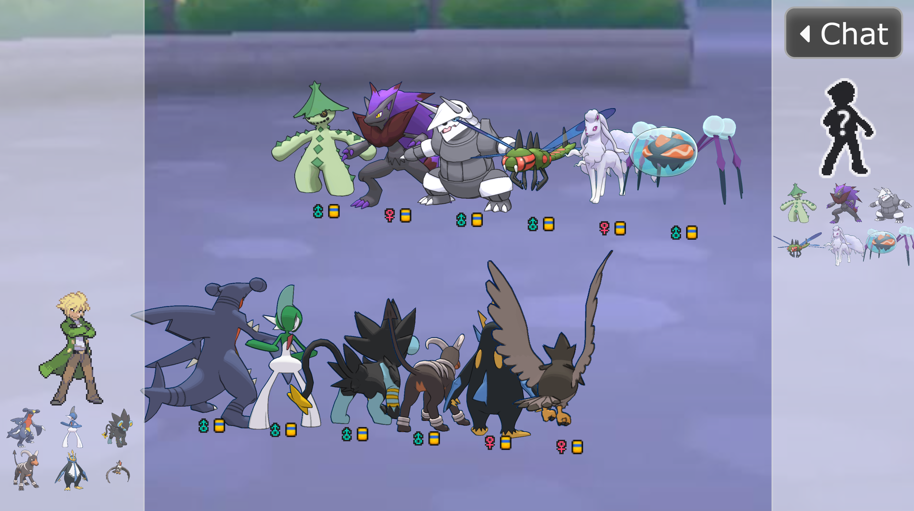

# Showdown HD Sprite Mod

This project is a mod that replaces the default Showdown Sprites with HD Sprites from PkParaíso.

This project is in a **Beta** phase, so use it with the knowledge that it might break!

Please **note**: This current state tries to get all images PkParaíso, since not all Pokémon are available as HD sprites, this also does not render every Pokémon in HD sprites.

Any issue or merge request is appreciated.

## Installation

1) Install the Tampermonkey addon here: [Tampermonkey Homepage](https://www.tampermonkey.net/index.php?ext=dhdg)
2) Select the `ShowdownHDSpriteMod` asset in this repo found under [Releases](https://github.com/FullLifeGames/ShowdownHDSpriteMod/releases)
   * This downloads the `ShowdownHDSpriteMod.js` which contains the source code needed
3) Open the `ShowdownHDSpriteMod.js` with an editor and copy the source code
4) Open Tampermonkey in your browser and click the `Add Script` tab (icon with a plus symbol)
5) Paste the source into the script window and hit save

## Examples

## Feedback

As previously said, any feedback or bug report is welcomed in the [Issues](https://github.com/FullLifeGames/ShowdownHDSpriteMod/issues) tab.   

## Including the Furret Turret Sprites

Since the [Furret Turret sprites](https://www.mediafire.com/folder/9t19091d3l857/Pok%C3%A9mon_Sprites) are to my knowledge not hosted on a single page as individual files, for including them you need to host them on your local machine.

After you download them from [here](https://www.mediafire.com/folder/9t19091d3l857/Pok%C3%A9mon_Sprites), follow these steps:

* Unpack them to a common directory (check the mod for folder names)
* Install [Node.js](https://nodejs.org/en/)
* Navigate in a command shell to the common directory (e.g. Open CMD and navigate with `cd {folderPath}`)
* Install the [http-server](https://www.npmjs.com/package/http-server) with: `npm install http-server -g`
* Run the [http-server](https://www.npmjs.com/package/http-server) with: `http-server --cors`
* Depending on your local configuration you might need to change some settings in the mod (like port etc.), but this should pretty much cover it
* Optional: For a better experience, you have to remove the `_` some images contain in their name, so that they can be found. You can do this with the `for f in *; do mv "$f" "${f//_/}"; done` command in the respective folders. Be however cautios and doublecheck, that this is what you want and that you are executing this in the correct folder!
